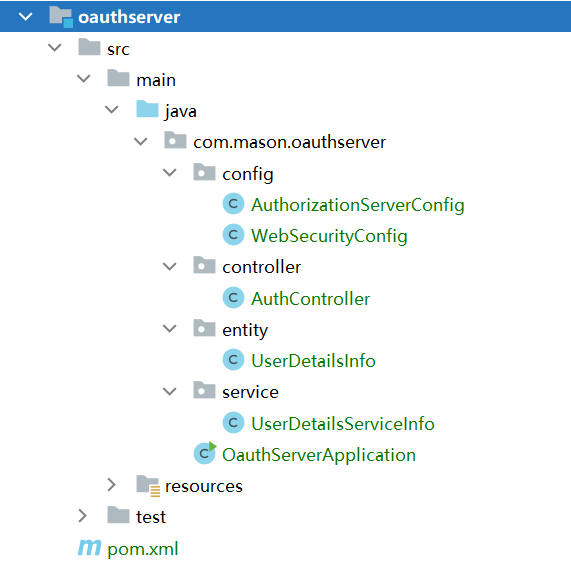
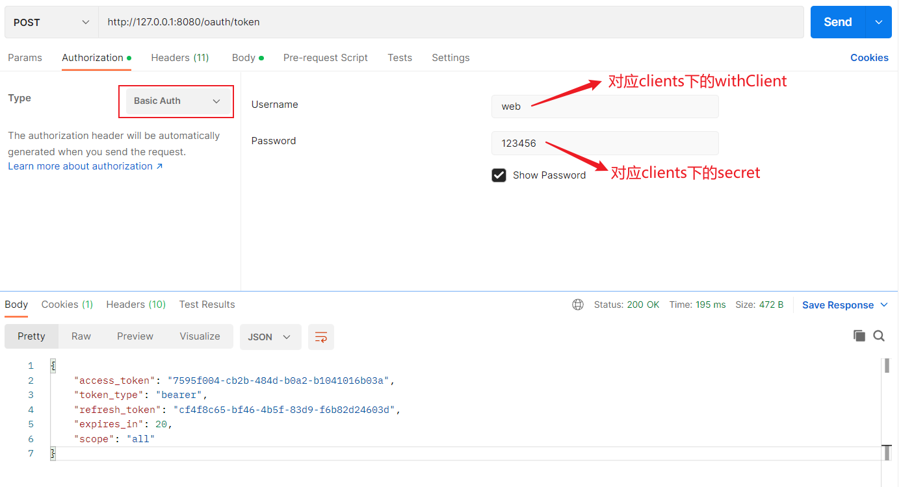

# 使用OAuth2实现单点登录


## 1 OAuth2基本介绍

OAuth2是一种授权协议，它的4种授权模式是授权码模式、密码模式、简化模式、客户端凭证模式。

在Spring Cloud OAuth2中设置授权模式如下：

| 授权模式   | Spring Cloud OAuth2中的配置（grant_type） |
| ---------- | ----------------------------------------- |
| 授权码模式 | authorization_code                        |
| 密码模式   | password                                  |
| 简化模式   | implicit                                  |
| 客户端凭证 | client_credentials                        |


## 2 Docker创建redis


创建目录和文件

```
# 进入home目录
cd /home

# 创建目录
mkdir redis

# 创建文件redis.conf
touch redis.conf

# 更改权限
chmod 777 redis.conf
```


**redis.conf**

```
# 可远程连接
# bind 127.0.0.1
# 解除保护模式
protected-mode no
# 数据持久化
appendonly yes
# 设置密码
requirepass 123456
```


创建redis容器

```
docker run -itd \
--name myredis \
--restart=always \
-p 6379:6379 \
-v /home/redis/redis.conf:/etc/redis/redis.conf \
-v /home/redis/data:/data \
redis:6.2.2 redis-server /etc/redis/redis.conf
```


## 3 工程介绍


### 3.1 简单介绍

要想自己定制，需要把OAuth2协议和SSO思想策略弄通才行。

我使用OAuth2的密码模式实现了简单的SSO，我使用oauthserver作为授权服务器，使用oauthresource作为客户端。可以根据情况使用@EnableOAuth2Sso注解使用授权码模式（更安全）登录。

oauthserver上实现继承了AuthorizationServerConfigurerAdapter和WebSecurityConfigurerAdapter的类；

oauthresource上实现继承了ResourceServerConfigurerAdapter的类。


项目在Github上的路径

```
https://github.com/MasonYyp/sso.git
```


### 3.2 项目目录


**sso下pom.xml文件**

```xml
<?xml version="1.0" encoding="UTF-8"?>
<project xmlns="http://maven.apache.org/POM/4.0.0"
         xmlns:xsi="http://www.w3.org/2001/XMLSchema-instance"
         xsi:schemaLocation="http://maven.apache.org/POM/4.0.0 http://maven.apache.org/xsd/maven-4.0.0.xsd">
    <modelVersion>4.0.0</modelVersion>

    <groupId>com.mason</groupId>
    <artifactId>sso</artifactId>
    <packaging>pom</packaging>
    <version>1.0</version>
    <modules>
        <module>oauthserver</module>
        <module>oauthresource</module>
    </modules>

    <properties>
        <java.version>11</java.version>
        <spring-boot-version>2.3.12.RELEASE</spring-boot-version>
        <maven.compiler.source>11</maven.compiler.source>
        <maven.compiler.target>11</maven.compiler.target>
    </properties>

    <dependencyManagement>

        <!-- 注意：尽量在此配置Spring-Boot版本，子应用中可以不配置SpringBoot版本 -->
        <dependencies>
            <dependency>
                <groupId>org.springframework.boot</groupId>
                <artifactId>spring-boot-dependencies</artifactId>
                <version>${spring-boot-version}</version>
                <type>pom</type>
                <scope>import</scope>
            </dependency>
        </dependencies>
    </dependencyManagement>

    <build>
        <plugins>
            <!-- 配置Maven插件 -->
            <plugin>
                <groupId>org.apache.maven.plugins</groupId>
                <artifactId>maven-compiler-plugin</artifactId>
                <version>3.1</version>
                <configuration>
                    <source>${java.version}</source>
                    <target>${java.version}</target>
                    <encoding>UTF-8</encoding>
                </configuration>
            </plugin>

            <plugin>
                <groupId>org.apache.maven.plugins</groupId>
                <artifactId>maven-surefire-plugin</artifactId>
                <version>2.22.0</version>
                <configuration>
                    <skipTests>true</skipTests>
                </configuration>
            </plugin>

            <plugin>
                <groupId>org.springframework.boot</groupId>
                <artifactId>spring-boot-maven-plugin</artifactId>
                <version>${spring-boot-version}</version>
            </plugin>

        </plugins>
    </build>

</project>
```


## 4 授权服务器

### 4.1 工程布局




### 4.2 pom.xml和application.yml

 **pom.xml**

```xml
<?xml version="1.0" encoding="UTF-8"?>
<project xmlns="http://maven.apache.org/POM/4.0.0"
         xmlns:xsi="http://www.w3.org/2001/XMLSchema-instance"
         xsi:schemaLocation="http://maven.apache.org/POM/4.0.0 http://maven.apache.org/xsd/maven-4.0.0.xsd">
    <parent>
        <artifactId>sso</artifactId>
        <groupId>com.mason</groupId>
        <version>1.0</version>
    </parent>
    <modelVersion>4.0.0</modelVersion>

    <artifactId>oauthserver</artifactId>

    <packaging>jar</packaging>

    <properties>
        <java.version>11</java.version>
        <spring-boot-version>2.3.12.RELEASE</spring-boot-version>
        <spring-cloud.version>Hoxton.SR12</spring-cloud.version>

        <maven.compiler.source>11</maven.compiler.source>
        <maven.compiler.target>11</maven.compiler.target>
    </properties>

    <dependencies>
        <dependency>
            <groupId>org.springframework.boot</groupId>
            <artifactId>spring-boot-starter-web</artifactId>
        </dependency>

        <!--
         注意：spring-cloud-starter-oauth2中包含spring-cloud-starter-security和spring-security-oauth2-autoconfigure
         -->
        <dependency>
            <groupId>org.springframework.cloud</groupId>
            <artifactId>spring-cloud-starter-oauth2</artifactId>
        </dependency>

        <dependency>
            <groupId>org.springframework.boot</groupId>
            <artifactId>spring-boot-starter-data-redis</artifactId>
        </dependency>

    </dependencies>

    <dependencyManagement>
        <dependencies>
            <dependency>
                <groupId>org.springframework.cloud</groupId>
                <artifactId>spring-cloud-dependencies</artifactId>
                <version>${spring-cloud.version}</version>
                <type>pom</type>
                <scope>import</scope>
            </dependency>
        </dependencies>
    </dependencyManagement>


</project>

```


**application.yml**

```
server:
  port: 8080

spring:
  redis:
    host: 192.168.108.200
    port: 6379
    password: 123456
    jedis:
      #连接超时时间
      timeout: 10000
      # 连接池
      pool:
        #最大连接数
        max-active: 8
        #最大阻塞等待时间(负数表示没限制)
        max-wait: -1
        #最大空闲
        max-idle: 8
        #最小空闲
        min-idle: 0
```


### 4.3 config包的AuthorizationServerConfig

```java
package com.mason.oauthserver.config;

import com.mason.oauthserver.service.UserDetailsServiceInfo;
import org.springframework.beans.factory.annotation.Autowired;
import org.springframework.context.annotation.Bean;
import org.springframework.context.annotation.Configuration;
import org.springframework.data.redis.connection.RedisConnectionFactory;
import org.springframework.security.authentication.AuthenticationManager;
import org.springframework.security.crypto.password.PasswordEncoder;
import org.springframework.security.oauth2.config.annotation.configurers.ClientDetailsServiceConfigurer;
import org.springframework.security.oauth2.config.annotation.web.configuration.AuthorizationServerConfigurerAdapter;
import org.springframework.security.oauth2.config.annotation.web.configuration.EnableAuthorizationServer;
import org.springframework.security.oauth2.config.annotation.web.configurers.AuthorizationServerEndpointsConfigurer;
import org.springframework.security.oauth2.config.annotation.web.configurers.AuthorizationServerSecurityConfigurer;
import org.springframework.security.oauth2.provider.token.TokenStore;
import org.springframework.security.oauth2.provider.token.store.JwtAccessTokenConverter;
import org.springframework.security.oauth2.provider.token.store.JwtTokenStore;
import org.springframework.security.oauth2.provider.token.store.redis.RedisTokenStore;


@Configuration
@EnableAuthorizationServer
public class AuthorizationServerConfig extends AuthorizationServerConfigurerAdapter {

    // 令牌端点的安全约束
    @Override
    public void configure(AuthorizationServerSecurityConfigurer security) throws Exception {
        security
                // 允许表单登录
                .allowFormAuthenticationForClients()
                // 公开token
                .tokenKeyAccess("permitAll()")
                // 全部允许验证token
                .checkTokenAccess("permitAll()");
    }


    /*
    // 使用redis存储token
    @Autowired
    private RedisConnectionFactory redisConnectionFactory;
    @Bean
    public TokenStore tokenStore(){
        return new RedisTokenStore(this.redisConnectionFactory);
    }

    // 自动创建UserDetailsServiceInfo实例
    @Autowired
    private UserDetailsServiceInfo userDetailsServiceInfo;
    // 自动加载WebSecurityConfig中的authenticationManagerBean()方法的返回值AuthenticationManager对象
    @Autowired
    private AuthenticationManager authenticationManager;
    // 令牌端点配置
    @Override
    public void configure(AuthorizationServerEndpointsConfigurer endpoints) throws Exception {
        super.configure(endpoints);
        // 认证管理器,密码模式时使用
        endpoints.authenticationManager(this.authenticationManager)
                // 会自动调用UserDetailsServiceInfo下的loadUserByUsername()方法
                .userDetailsService(this.userDetailsServiceInfo)
                .tokenStore(this.tokenStore());
    }
    */


    // 用内存存储
    // 自动创建UserDetailsServiceInfo实例
    @Autowired
    private UserDetailsServiceInfo userDetailsServiceInfo;
    // 自动加载WebSecurityConfig中的authenticationManagerBean()方法的返回值AuthenticationManager对象
    @Autowired
    private AuthenticationManager authenticationManager;
    // 令牌端点配置
    @Override
    public void configure(AuthorizationServerEndpointsConfigurer endpoints) throws Exception {
        super.configure(endpoints);
        // 认证管理器,密码模式时使用
        endpoints.authenticationManager(this.authenticationManager)
                // 会自动调用UserDetailsServiceInfo下的loadUserByUsername()方法
                .userDetailsService(this.userDetailsServiceInfo);
    }

    /*@Bean
    public JwtTokenStore jwtTokenStore() {
        return new JwtTokenStore(jwtAccessTokenConverter());
    }

    @Bean
    public JwtAccessTokenConverter jwtAccessTokenConverter() {
        JwtAccessTokenConverter jwtAccessTokenConverter = new JwtAccessTokenConverter();
        jwtAccessTokenConverter.setSigningKey("123456");
        return jwtAccessTokenConverter;
    }*/

    // 自动加载WebSecurityConfig中的bcryptPasswordEncoder()方法的返回值BCryptPasswordEncoder对象
    @Autowired
    private PasswordEncoder bcryptPasswordEncoder;
    // 客户端信息配置
    @Override
    public void configure(ClientDetailsServiceConfigurer clients) throws Exception {
        clients.inMemory()
                // 客户端名称
                .withClient("web")
                // 客户端密钥
                .secret(this.bcryptPasswordEncoder.encode("123456"))
                // 设置授权模式为password
                .authorizedGrantTypes("password", "refresh_token")
                .scopes("all")
                // 设置token有效期
                .accessTokenValiditySeconds(20)
                // 设置刷新token的有效期
                .refreshTokenValiditySeconds(20)
                .autoApprove(true)

                .and()

                // 客户端名称
                .withClient("app")
                // 客户端密钥
                .secret(this.bcryptPasswordEncoder.encode("123456"))
                // 设置授权模式为password
                .authorizedGrantTypes("password", "authorization_code", "refresh_token")
                .scopes("all")
                // 设置token有效期
                .accessTokenValiditySeconds(20)
                // 设置刷新token的有效期
                .refreshTokenValiditySeconds(20)
                // 配置授权码模式必须配置uri，否则授权后跳转无权限
                .redirectUris("http://www.baidu.com")
                .autoApprove(true);

    }

}

```


### 4.4 config包WebSecurityConfig

```java
package com.mason.oauthserver.config;

import org.springframework.context.annotation.Bean;
import org.springframework.context.annotation.Configuration;
import org.springframework.security.authentication.AuthenticationManager;
import org.springframework.security.config.annotation.web.builders.HttpSecurity;
import org.springframework.security.config.annotation.web.configuration.EnableWebSecurity;
import org.springframework.security.config.annotation.web.configuration.WebSecurityConfigurerAdapter;
import org.springframework.security.crypto.bcrypt.BCryptPasswordEncoder;
import org.springframework.security.crypto.password.PasswordEncoder;


@Configuration
@EnableWebSecurity
public class WebSecurityConfig extends WebSecurityConfigurerAdapter {

    // 用户权限管理器，进行用户认证，配置用户签名服务和用户权限控制
    @Bean
    @Override
    public AuthenticationManager authenticationManagerBean() throws Exception {
        return super.authenticationManagerBean();
    }


    // 将BCryptPasswordEncoder对象注入Spring容器中，
    // SpringSecurity会使用PasswordEncoder自动密码校验
    @Bean
    public PasswordEncoder bcryptPasswordEncoder(){
        return new BCryptPasswordEncoder();
    }

    // 用户授权，配置拦截请求、请求验证、异常处理
    @Override
    protected void configure(HttpSecurity http) throws Exception {
        //关闭csrf
        http.csrf().disable();

        // 解决跨域
        http.cors();

        // 开启Spring Security默认的表单登录
        http.formLogin();
                // 根据需求，自定义登录页面，注意不要拦截此Action
//              .loginPage("/login");

        // 设置认证的action
        http.authorizeRequests()
                // 不拦截以下action
                .antMatchers("/sso/register").permitAll()

                // 处了上面的action，都需要鉴权认证
                .anyRequest().authenticated();
    }


}

```


### 4.5 controller包的AuthController

```java
package com.mason.oauthserver.controller;

import org.springframework.stereotype.Controller;
import org.springframework.web.bind.annotation.GetMapping;
import org.springframework.web.bind.annotation.RequestMapping;
import org.springframework.web.bind.annotation.ResponseBody;

@Controller
@ResponseBody
@RequestMapping("/sso")
public class AuthController {

    @GetMapping("/register")
    public String register(){
        return "register";
    }

}

```


### 4.6 entity包的UserDetailsInfo

```java
package com.mason.oauthserver.entity;

import org.springframework.security.core.GrantedAuthority;
import org.springframework.security.core.userdetails.UserDetails;

import java.util.Collection;


public class UserDetailsInfo implements UserDetails {
    // 用户基本信息
    private String id;
    private String username;
    private String password;
    private Collection<? extends GrantedAuthority> authorities;

    public UserDetailsInfo(String id, String username, String password, Collection<? extends GrantedAuthority> authorities) {
        super();
        this.id = id;
        this.username = username;
        this.password = password;
        this.authorities = authorities;
    }

    public String getId() {
        return id;
    }
    public void setId(String id) {
        this.id = id;
    }

    public void setUsername(String username) {
        this.username = username;
    }
    @Override
    public String getUsername() {
        return this.username;
    }

    public void setPassword(String password) {
        this.password = password;
    }
    @Override
    public String getPassword() {
        return this.password;
    }

    public void setAuthorities(Collection<? extends GrantedAuthority> authorities) {
        this.authorities = authorities;
    }
    @Override
    public Collection<? extends GrantedAuthority> getAuthorities() {
        return this.authorities;
    }

    // 注意：下面的返回值必须都是true
    @Override
    public boolean isAccountNonExpired() {
        return true;
    }

    @Override
    public boolean isAccountNonLocked() {
        return true;
    }

    @Override
    public boolean isCredentialsNonExpired() {
        return true;
    }

    @Override
    public boolean isEnabled() {
        return true;
    }
}

```


### 4.7 service包的UserDetailsServiceInfo

```java
package com.mason.oauthserver.service;

import com.mason.oauthserver.entity.UserDetailsInfo;
import org.springframework.beans.factory.annotation.Autowired;
import org.springframework.security.core.authority.AuthorityUtils;
import org.springframework.security.core.userdetails.User;
import org.springframework.security.core.userdetails.UserDetails;
import org.springframework.security.core.userdetails.UserDetailsService;
import org.springframework.security.core.userdetails.UsernameNotFoundException;
import org.springframework.security.crypto.password.PasswordEncoder;
import org.springframework.stereotype.Service;


@Service
public class UserDetailsServiceInfo implements UserDetailsService {

    // 自动加载WebSecurityConfig中的bcryptPasswordEncoder()方法的返回值BCryptPasswordEncoder对象
    @Autowired
    private PasswordEncoder bcryptPasswordEncoder;

    @Override
    public UserDetails loadUserByUsername(String username) throws UsernameNotFoundException {
        // (1)根据username查询数据库，找到账号和密码，下面类似查数据库
        if (!"admin".equals(username)){
            // 查不到数据返回null即可
            return null;
        }

        // (2) 对查询的密码进行加密，如果数据库的密码已经加密，此处不做。
        String password = this.bcryptPasswordEncoder.encode("123456");

        // (3) 生成User对象

        /*
        // 使用userdetails自带的UserDetails的对象User
        User user = new User("admin",password, AuthorityUtils.commaSeparatedStringToAuthorityList("admin, secretary"));
        return user;
        */

        // 使用自定义的UserDetails对象UserDetailsInfo
        UserDetailsInfo userDetailsInfo = new UserDetailsInfo("1","admin", password, null);
        return userDetailsInfo;

    }

}

```


### 4.8 OauthServerApplication

```java
package com.mason.oauthserver;

import org.springframework.boot.SpringApplication;
import org.springframework.boot.autoconfigure.SpringBootApplication;
import org.springframework.security.oauth2.config.annotation.web.configuration.EnableAuthorizationServer;

@SpringBootApplication
@EnableAuthorizationServer
public class OauthServerApplication {
    public static void main(String[] args) {
        SpringApplication.run(OauthServerApplication.class, args);
    }
}

```


## 5 客户端服务器


### 5.1 工程布局


### 5.2 pom.xml和application.yml


**pom.xml**

```xml
<?xml version="1.0" encoding="UTF-8"?>
<project xmlns="http://maven.apache.org/POM/4.0.0"
         xmlns:xsi="http://www.w3.org/2001/XMLSchema-instance"
         xsi:schemaLocation="http://maven.apache.org/POM/4.0.0 http://maven.apache.org/xsd/maven-4.0.0.xsd">
    <parent>
        <artifactId>sso</artifactId>
        <groupId>com.mason</groupId>
        <version>1.0</version>
    </parent>
    <modelVersion>4.0.0</modelVersion>

    <artifactId>oauthresource</artifactId>

    <packaging>jar</packaging>

    <properties>
        <java.version>11</java.version>
        <spring-boot-version>2.3.12.RELEASE</spring-boot-version>
        <spring-cloud.version>Hoxton.SR12</spring-cloud.version>

        <maven.compiler.source>11</maven.compiler.source>
        <maven.compiler.target>11</maven.compiler.target>
    </properties>

    <dependencies>
        <dependency>
            <groupId>org.springframework.boot</groupId>
            <artifactId>spring-boot-starter-web</artifactId>
        </dependency>

        <!--
         注意：spring-cloud-starter-oauth2中包含spring-cloud-starter-security和spring-security-oauth2-autoconfigure
         -->
        <dependency>
            <groupId>org.springframework.cloud</groupId>
            <artifactId>spring-cloud-starter-oauth2</artifactId>
        </dependency>

        <dependency>
            <groupId>org.springframework.boot</groupId>
            <artifactId>spring-boot-starter-data-redis</artifactId>
        </dependency>

    </dependencies>

    <dependencyManagement>
        <dependencies>
            <dependency>
                <groupId>org.springframework.cloud</groupId>
                <artifactId>spring-cloud-dependencies</artifactId>
                <version>${spring-cloud.version}</version>
                <type>pom</type>
                <scope>import</scope>
            </dependency>
        </dependencies>
    </dependencyManagement>

</project>
```


**application.yml**

```yml
server:
  port: 8082

security:
  oauth2:
    client:
      # 配置授权服务器参数
      client-id: web
      client-secret: 123456
      # 配置获取token
      access-token-uri: http://127.0.0.1:8080/oauth/token
      # 配置授权码模式认证，如果只有密码模式，此处可以不配置
      # user-authorization-uri: http://127.0.0.1:8080/oauth/authorize

    resource:
      # 验证Token，并返回客户端信息
      token-info-uri: http://127.0.0.1:8080/oauth/check_token

```


### 5.3 config包的ResourceServerConfig

```
package com.mason.oauthresource.config;

import org.springframework.context.annotation.Configuration;
import org.springframework.security.config.annotation.method.configuration.EnableGlobalMethodSecurity;
import org.springframework.security.config.annotation.web.builders.HttpSecurity;
import org.springframework.security.oauth2.config.annotation.web.configuration.EnableResourceServer;
import org.springframework.security.oauth2.config.annotation.web.configuration.ResourceServerConfigurerAdapter;


@Configuration
@EnableResourceServer
@EnableGlobalMethodSecurity(prePostEnabled = true)
public class ResourceServerConfig extends ResourceServerConfigurerAdapter {

    @Override
    public void configure(HttpSecurity http) throws Exception {

        //关闭csrf
        http.csrf().disable();

        // 解决跨域
        http.cors();

        // 登录，此处可以不设置，默认会跳转到SpringSecurity的登录页面
//        http.formLogin();

        // 设置认证的action
        http.authorizeRequests()
                // 不拦截以下action
                .antMatchers("/data/common")
                .permitAll()

                // 处了上面的action，都需要鉴权认证
                .anyRequest().authenticated();

    }

}

```


### 5.4 controller包的MyResourceController

```
package com.mason.oauthresource.controller;

import org.springframework.stereotype.Controller;
import org.springframework.web.bind.annotation.PostMapping;
import org.springframework.web.bind.annotation.RequestMapping;
import org.springframework.web.bind.annotation.ResponseBody;

@Controller
@ResponseBody
@RequestMapping("/data")
public class MyResourceController {

    @PostMapping("/common")
    public String common(){
        return "My common data";
    }

    @PostMapping("/info")
    public String info(){
        return "Data -- I am Mason";
    }
}

```


### 5.5 OauthResourceApplication

```java
package com.mason.oauthresource;


import org.springframework.boot.SpringApplication;
import org.springframework.boot.autoconfigure.SpringBootApplication;

@SpringBootApplication
public class OauthResourceApplication {
    public static void main(String[] args) {
        SpringApplication.run(OauthResourceApplication.class, args);
    }
}

```


## 6 测试


应用启动后自动增加的控制器

| 请求方法 | 接口               | 接口作用                  |
| -------- | ------------------ | ------------------------- |
| GET/POST | /oauth/token       | 获取 token，也可刷新token |
| GET/POST | /oauth/authorize   | 授权码模式认证            |
| GET/POST | /oauth/check_token | 验证token 合法性          |


### 6.1 密码模式


#### **6.1.1 获取token**

```
# 验证地址
http://127.0.0.1:8080/oauth/token

# 配置参数
grant_type  password
client_id	web
client_secret	123456
username	admin
password	123456
scope		all
```


**验证方法1（推荐）**


**验证方法2**


（1）先设置权限




（2）配置账号信息


#### **6.1.2 刷新token**

```
# 验证地址
http://127.0.0.1:8080/oauth/token

# 配置参数
grant_type  refresh_token
client_id	web
client_secret	123456
refresh_token	cf4f8c65-bf46-4b5f-83d9-f6b82d24603d	
```


#### 6.1.3 验证token

```
# 验证地址
http://127.0.0.1:8080/oauth/check_token

# 配置参数，token是获取token中的access_token
token	742a0ad7-5392-4cb1-8f42-09471b54e639	
```


### 6.2 授权码模式


**获取授权码**

```
# 在浏览器中输入下面的验证地址，系统会自动跳转到Spring Security登录页面
http://127.0.0.1:8080/oauth/authorize?client_id=app&response_type=code&scope=all&redirect_uri=http://www.baidu.com
```


```
# 验证地址
http://127.0.0.1:8080/oauth/token

# 配置参数
grant_type  authorization_code
client_id	app
client_secret	123456
code	IlkQ8j //上图的值
redirect_uri  http://www.baidu.com
scope	all
```


### 6.3 测试客户端


**访问具有权限的数据**

```
# 验证地址
http://127.0.0.1:8082/data/info

# 配置参数，token是获取token中的access_token
token	742a0ad7-5392-4cb1-8f42-09471b54e639	
```

:warning: 注意：token需要使用Bearer Token


**访问无权限的数据**

```
# 验证地址
http://127.0.0.1:8082/data/common
```

